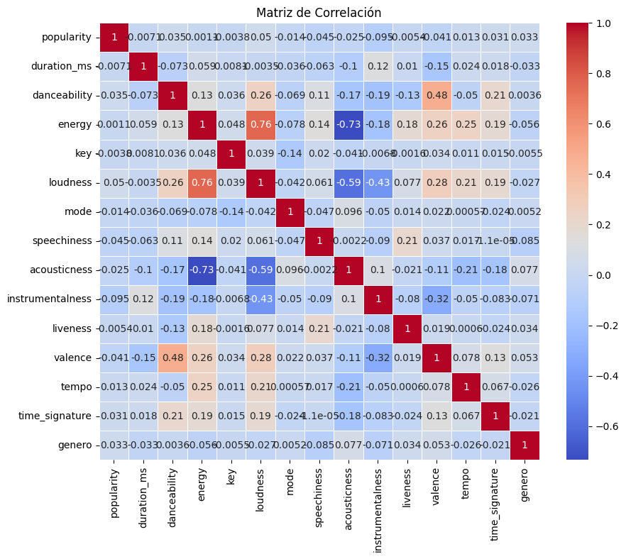
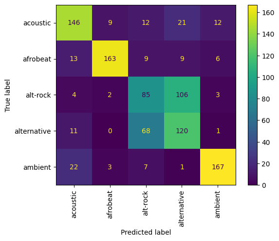
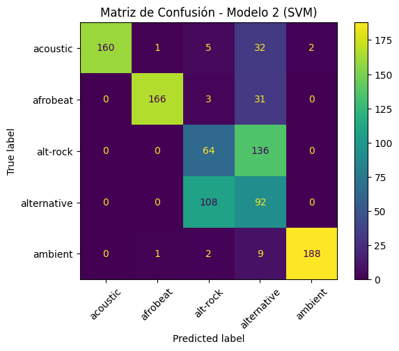
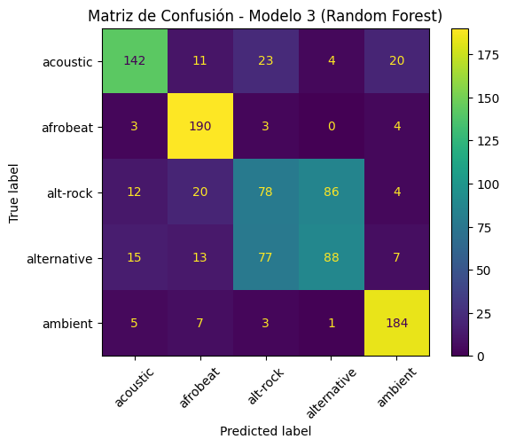

# aprendizaje-automatico-grupo6

## 📑 Índice
1. [📂 Descripción y Estructura del Proyecto](#1---descripción-y-estructura-del-proyecto)
2. [🔍 Análisis Exploratorio de Datos (EDA)](#2---análisis-exploratorio-de-datos-eda)
   1. [:pencil: Descripción de Variables y Clases](#21--pencil-descripción-de-variables-y-clases)
   2. [:pencil: Matriz de Correlación](#22-pencil-matriz-de-correlación)
   3. [:pencil: Eliminación de Variables Irrelevantes](#23-eliminación-de-variables-irrelevantes)
3. [⚙️ Preprocesamiento](#3--️-preprocesamiento)
   1. [:pencil: Tratamiento de nulos, codificación de variables y escalado de variables numéricas](#31-pencil-tratamiento-de-nulos-codificación-de-variables-categóricas-y-escalado-de-variables-numéricas)
   2. [:pencil: División en conjunto de entrenamiento y prueba](#32-pencil-división-en-conjunto-de-entrenamiento-y-prueba-8020)
4. [🤖 Implementación de clasificadores](#4---implementación-de-clasificadores)
   1. [💻 Modelo 1: Árbol de decisión](#41---modelo-1-árbol-de-decisión)
   2. [💻 Modelo 2: SVM](#42---modelo-2-svm-con-ajuste-de-kernel-y-c)
   3. [💻 Modelo 3: Random Forest](#43---modelo-3-random-forest)
5. [✅ Comparación experimental](#5---comparación-experimental)
 
## 1.- 📂 Descripción y Estructura del Proyecto

El dataset utilizado en este proyecto es el siguiente:
[Spotify Tracks Dataset](https://www.kaggle.com/datasets/maharshipandya/-spotify-tracks-dataset/data)
Este es un conjunto de datos de pistas de Spotify de 125 géneros diferentes. Cada pista tiene características de audio asociadas. Los datos están en formato CSV

```bash
Deber_Semana2/
├── src/                  # Código fuente
├── dataset/              # Dataset original, descargado de https://www.kaggle.com/
├── imagenes/             # Imágenes generadas en en google Colab durante el desarrollo
└── README.md             # Este archivo
```
## 2.- 🔍 Análisis Exploratorio de Datos (EDA)
En esta sección, se presenta un resumen del análisis exploratorio realizado sobre el dataset. El objetivo principal fue obtener una comprensión inicial de los datos, visualizar las relaciones entre las variables e identificar variables irrelevantes.
### 2.1.- :pencil: Descripción de Variables y Clases
El dataset contiene las siguientes variables:

| Nº  | Variable           | Tipo de Dato | Descripción breve                                              |
|-----|--------------------|--------------|----------------------------------------------------------------|
| 0   | Unnamed: 0         | int64        | Índice automático del dataset                                  |
| 1   | track_id           | object       | ID único de la canción                                         |
| 2   | artists            | object       | Nombre(s) del/los artista(s)                                   |
| 3   | album_name         | object       | Nombre del álbum                                               |
| 4   | track_name         | object       | Título de la canción                                           |
| 5   | popularity         | int64        | Popularidad en plataforma                                      |
| 6   | duration_ms        | int64        | Duración en milisegundos                                       |
| 7   | explicit           | bool         | Contenido explícito (sí/no)                                    |
| 8   | danceability       | float64      | Nivel de facilidad para bailar                                 |
| 9   | energy             | float64      | Nivel de intensidad musical                                    |
| 10  | key                | int64        | Tono musical (clave)                                           |
| 11  | loudness           | float64      | Volumen medio en decibelios                                    |
| 12  | mode               | int64        | Modo: mayor o menor                                            |
| 13  | speechiness        | float64      | Presencia de voz hablada                                       |
| 14  | acousticness       | float64      | Grado de carácter acústico                                     |
| 15  | instrumentalness   | float64      | Probabilidad de ser instrumental                               |
| 16  | liveness           | float64      | Presencia de público en vivo                                   |
| 17  | valence            | float64      | Positividad o alegría percibida                                |
| 18  | tempo              | float64      | Velocidad (BPM) de la canción                                  |
| 19  | time_signature     | int64        | Compás de la canción                                           |
| 20  | track_genre        | object       | Género musical principal (Variable objetivo o Clase)           |

### 2.2 :pencil: Matriz de Correlación


#### Análisis
- **energy** y **loudness**: Tienen la correlación más alta (0.76). Las canciones más energéticas tienden a ser más ruidosas.
- **acousticness** y **energy**: Tienen una correlación muy negativa (-0.73). Cuanto más acústica es una canción, menos energética suele ser.
- **danceability** y **valence**: Tienen una correlación de 0.48. Las canciones más bailables suelen ser más alegres.
- **popularity**: Tiene correlaciones muy bajas con casi todas las variables. La popularidad no parece tener relación con ninguna característica técnica de la canción.
- **key**: Tiene una correlación muy baja con casi todas las variables y prácticamente insignificante con el género.

#### Conclusiones de la Matriz de Correlación
1. Aunque hay variables como **popularity** y **time_signature** que tienen correlaciones muy bajas, podrían ser útiles combinadas con las otras variables.
2. La variable **key** tiene una relación insignificante con casi todas las variables, pero su valor representa el tono musical y podría ser útil.
3. Solo se eliminarán las variables que correspondan a índices o identificadores únicos; el resto son datos técnicos de la canción que podrían ser útiles para su clasificación

#### 2.3 :pencil: Eliminación de Variables Irrelevantes
Se eliminaron las siguientes variables por no aportar valor al análisis o por generar ruido en los datos:

- `Unnamed: 0`: identificador de registro sin utilidad analítica.
- `track_id`: identificador alfanumérico único, no necesario para el modelo.
  
Al final quedaron 18 variables Y 1 CLASE O VARIABLE OBJETIVO (track_genre)

## 3.- ⚙️ Preprocesamiento
Dado que el dataset original contiene 114000 filas, se seleccionarán solo 5000 para agilizar la ejecución de las pruebas.
Se seleccionarán los primeros 5000 registros para limitar un poco la cantidad de clases a predecir (originalmente hay más de 100).
### 3.1 :pencil: Tratamiento de nulos, codificación de variables categóricas y escalado de variables numéricas.
```python
#ELIMINACION DE POSIBLES NULOS
df_exploratorio = df_exploratorio.dropna()
#SELECCIONO LOS PRIMEROS 5000 PARA LIMITAR UN POCO LAS CANTIDAD DE CLASES A PREDECIR (ORIGINALMENTE HAY MÁS DE 100)
df_aleatorio =  df_exploratorio[:5000] 
#SEPARAR VARIABLES DE CLASE O VARIABLE OBJETIVO X E Y
#A LA VARIABLE X LE QUITO LA COLUMNAS TRACK_GENRE QUE CORRESPONDE A LA CLASE O VARIABLE OBJETIVO QUE SE VA ANALIZAR
X = df_aleatorio.drop(columns=["track_genre"]) 
Y = df_aleatorio["track_genre"]
#CODIFICAR LAS VARIABLES CATEGORICAS EN X SI EXISTIERAN
X = pd.get_dummies(X)
#CODIFICAR LA VARIABLE OBJETIVO O CLASES
le = LabelEncoder()
Y_codificado = le.fit_transform(Y)
#ESCALADO DE VARIABLES O CARACTERISTICAS X
scaler = StandardScaler()
X_scalado = scaler.fit_transform(X)
```
### 3.2 :pencil: División en conjunto de entrenamiento y prueba (80/20).
```python
#test_size=0.2: El 20% de los datos serán usados para prueba.
#stratify=Y: garantiza que la proporción de clases (track_genre) sea igual en entrenamiento y prueba.
X_train, X_test, Y_train, Y_test = train_test_split(X_scalado, Y_codificado, test_size=0.2, random_state=42,stratify=Y_codificado)
```
- **Tamaño del subdataset aleatorio**: (5000, 19)
- **Tamaño del conjunto de entrenamiento**: (4000, 7656)
- **Tamaño del conjunto de prueba**: (1000, 7656)
## 4.- 🤖 Implementación de clasificadores
### 4.1.- 💻 Modelo 1: Árbol de decisión

Para seleccionar los hiperparámetros, se realizó una búsqueda exhaustiva para encontrar la mejor combinación de parámetros para un modelo de árbol de decisión, utilizando GridSearchCV.
La búsqueda se configuró de la siguiente manera
```python
param_grid = {
    'criterion': ['gini', 'entropy', 'log_loss'],
    'max_depth': [None, 5, 10, 20, 30],
    'min_samples_split': [2, 5, 10],
    'min_samples_leaf': [1, 2, 4],
    'max_features': [None, 'sqrt', 'log2']
}
#grid_search = GridSearchCV(estimator=clf_tree, param_grid=param_grid,cv=5, n_jobs=-1, verbose=1, scoring='accuracy')
```
Los mejores hiperparámetros encontrados fueron:
- **criterion= 'entropy'**: Este parámetro determina cómo se mide la calidad de una división en el árbol
- **max_depth=10**: Limita la profundidad máxima del árbol. Esto significa que el árbol no tendrá más de 10 niveles de profundidad, lo cual ayuda a evitar el sobreajuste
- **max_features=None**: Esto indica que se considerarán todas las características (columnas) del conjunto de datos al hacer cada división en el árbol.
- **min_samples_leaf=1**: Establece el número mínimo de muestras requeridas en una hoja del árbol. En este caso, solo se necesita 1 muestra en cada hoja. Si se aumenta este valor, el árbol será más general y menos propenso a sobreajustarse.
- **min_samples_split=2**: Define el número mínimo de muestras necesarias para dividir un nodo. Si un nodo tiene menos de 2 muestras, no se podrá dividir más.
#### 4.1.1 Resultados
##### Matriz de Confusión Árbol de decisión

##### Métricas
| Precisión           | Recall             | F1-score           |
|---------------------|--------------------|--------------------|
| 0.7018081966371774  | 0.6849999999999999 | 0.6904668808598403 |

### 4.2.- 💻 Modelo 2: SVM (con ajuste de kernel y C)
En este modelo SVC se ha seleccionado el kernel lineal, ideal para problemas linealmente separables y de interpretación sencilla. El parámetro C se ha ajustado con distintos valores (0.1, 1, 10) para controlar el equilibrio entre un margen amplio y la clasificación correcta de los puntos de entrenamiento.
La búsqueda se configuró de la siguiente manera
```python
svc = SVC()
param_dist_svc = {
    'C': [0.1, 1, 10],
    'kernel': ['linear'],
    'gamma': ['scale']
}
svc_random = RandomizedSearchCV(svc, param_distributions=param_dist_svc, n_iter=3, cv=3, verbose=1, n_jobs=-1)
svc_random.fit(X_train, Y_train)
svc_best = svc_random.best_estimator_
Y_pred_svc = svc_best.predict(X_test)
```
Los mejores hiperparámetros encontrados fueron:
- En **C = 10**, aunque un valor de 5 podría haber sido suficiente, ya que el rendimiento no varió significativamente.
- Se utilizó el **kernel lineal** debido a que alcanzó una precisión del 67%, mientras que con el **kernel RBF** la precisión no superaba el 62%.
#### 4.2.1 Resultados
##### Matriz de Confusión para SVM

##### Métricas
| Precisión           | Recall             | F1-score           |
|---------------------|--------------------|--------------------|
| 0.67                | 0.67               | 0.691648780013269  |
### 4.3.- 💻 Modelo 3: Random Forest 
En este modelo Random Forest se exploraron parámetros clave para controlar la complejidad del árbol y evitar el sobreajuste. Se ajustaron la profundidad máxima del árbol (max_depth), el mínimo de muestras por hoja (min_samples_leaf) y el mínimo de muestras para dividir un nodo (min_samples_split).
La búsqueda se configuró de la siguiente manera
```python
rf = RandomForestClassifier(random_state=42)
param_dist_rf = {
    'n_estimators': [100, 200],
    'max_depth': [None, 10],
    'min_samples_leaf': [1, 2],
    'min_samples_split': [2, 5]
}
rf_random = RandomizedSearchCV(rf, param_distributions=param_dist_rf, n_iter=4, cv=3, verbose=1, n_jobs=-1)
rf_random.fit(X_train, Y_train)
rf_best = rf_random.best_estimator_
Y_pred_rf = rf_best.predict(X_test)
```
Los mejores hiperparámetros encontrados fueron:
-**n_estimators = 200:** Se usaron 200 árboles para mejorar la estabilidad y reducir la varianza del modelo.

-**max_depth = None:** Se permitió que los árboles crecieran sin límite para capturar patrones complejos.

-**min_samples_leaf = 1:** Se aceptó que cada hoja contenga al menos una muestra, permitiendo alta precisión en los ajustes.

-**min_samples_split = 2:** Los nodos se dividieron con al menos dos muestras, favoreciendo árboles detallados.

#### 4.3.1 Resultados
##### Matriz de Confusión para Random Forest

##### Métricas
| Precisión           | Recall             | F1-score           |
|---------------------|--------------------|--------------------|
| 0.697               | 0.6970000000000001 | 0.6948600689406443 |
## 5.- ✅ Comparación experimental

Resultados obtenidos:

| Modelo                           | Precisión |  Recall  | F1-score |
|----------------------------------|-----------|----------|----------|
| **Modelo 1: Árbol de Decisión**  | 0.7018    | 0.6850   | 0.6905   |
| **Modelo 2: SVM**                | 0.6700    | 0.6700   | 0.6916   |
| **Modelo 3: Random Forest**      | 0.6970    | 0.6970   | 0.6948   |


